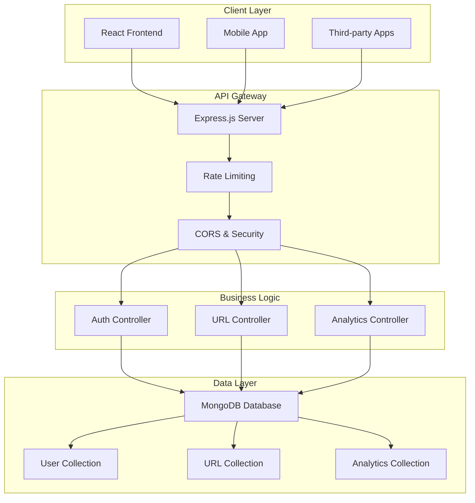

# 🔗 URL Shortener

<div align="center">


A modern, full-stack URL shortening service with comprehensive analytics and user management.

[](https://url-shortener-basic.vercel.app/)
[](./backend/README.md)

</div>

## 📋 Table of Contents

- [✨ Features](#-features)
- [🛠️ Tech Stack](#️-tech-stack)
- [🏗️ Architecture](#️-architecture)
- [🚀 Quick Start](#-quick-start)
- [📱 Usage Guide](#-usage-guide)
- [🔒 Security](#-security)
- [📊 Performance](#-performance)
- [🌐 Deployment](#-deployment)
- [🤝 Contributing](#-contributing)
- [📄 License](#-license)

## ✨ Features

### 🎯 Core Functionality

- **Instant URL Shortening**: Create short, memorable links in seconds
- **Custom Aliases**: Choose your own custom short URLs
- **Bulk URL Management**: Handle multiple URLs efficiently

###  User Management

- **Secure Authentication**: JWT-based login with refresh tokens
- **User Dashboard**: Centralized management of all shortened URLs
- **Session Management**: Secure logout and token refresh

###  Analytics & Tracking

- **Click Analytics**: Monitor traffic and engagement metrics
- **Referrer Tracking**: Track where your clicks are coming from

- **Time-based Analytics**: Track clicks over time periods


### Developer Features

- **RESTful API**: Complete API for integration
- **Rate Limiting**: Prevent abuse with configurable limits
- **API Documentation**: Comprehensive API docs with examples
- **Webhook Support**: Real-time notifications for events

## Tech Stack

### Frontend

| Technology          | Version | Purpose                 |
| ------------------- | ------- | ----------------------- |
| **React**           | 19.1.1  | UI Framework            |
| **Vite**            | 7.1.7   | Build Tool & Dev Server |
| **Tailwind CSS**    | 4.1.14  | Styling Framework       |
| **React Router**    | 7.9.4   | Client-side Routing     |
| **Axios**           | 1.12.2  | HTTP Client             |
| **React Hot Toast** | 2.6.0   | Notifications           |
| **React Icons**     | 5.5.0   | Icon Library            |

### Backend

| Technology     | Version | Purpose             |
| -------------- | ------- | ------------------- |
| **Node.js**    | Latest  | Runtime Environment |
| **Express.js** | 5.1.0   | Web Framework       |
| **MongoDB**    | Latest  | Database            |
| **Mongoose**   | 8.19.0  | ODM                 |
| **JWT**        | 9.0.2   | Authentication      |
| **bcryptjs**   | 3.0.2   | Password Hashing    |
| **Helmet**     | 8.1.0   | Security Headers    |
| **Morgan**     | 1.10.1  | HTTP Logging        |

### DevOps & Tools

| Tool               | Purpose                |
| ------------------ | ---------------------- |
| **Vercel**         | Frontend Deployment    |
| **Render**         | Backend Deployment     |
| **GitHub Actions** | CI/CD Pipeline         |
| **ESLint**         | Code Quality           |
| **Nodemon**        | Development Hot Reload |

## 🏗️ Architecture



### Project Structure

```
URL Shortener/
├── 📁 frontend/                 # React frontend application
│   ├── 📁 src/
│   │   ├── 📁 components/       # Reusable UI components
│   │   ├── 📁 pages/            # Page components
│   │   ├── 📁 hooks/            # Custom React hooks
│   │   ├── 📁 utils/            # Utility functions
│   │   └── 📄 api.js            # API client configuration
│   ├── 📄 vite.config.mjs       # Vite configuration
│   └── 📄 vercel.json           # Deployment configuration
│
├── 📁 backend/                  # Node.js backend API
│   ├── 📁 src/
│   │   ├── 📁 config/           # Configuration files
│   │   ├── 📁 controllers/      # Request handlers
│   │   ├── 📁 middlewares/      # Express middlewares
│   │   ├── 📁 models/           # Database models
│   │   ├── 📁 routes/           # API routes
│   │   ├── 📁 utils/            # Utility functions
│   │   └── 📁 logs/             # Application logs
│   └── 📄 .env                  # Environment variables
│
└── 📁 docs/                     # Documentation
    ├── 📄 API.md               # API documentation
    ├── 📄 DEPLOYMENT.md        # Deployment guide
    └── 📄 CONTRIBUTING.md      # Contribution guidelines
```

## Quick Start

### Prerequisites

- **Node.js** (v18 or higher)
- **MongoDB** (v6 or higher)
- **npm** or **yarn**
- **Git**

### Installation

1. **Clone the repository**

   ```bash
   git clone https://github.com/yourusername/url-shortener.git
   cd url-shortener
   ```

2. **Set up the backend**

   ```bash
   cd backend
   npm install

   # Create environment file
   cp .env.example .env
   # Edit .env with your configuration

   # Start development server
   npm run backend
   ```

3. **Set up the frontend**

   ```bash
   cd ../frontend
   npm install

   # Start development server
   npm run dev
   ```

4. **Access the application**
   -  **Frontend**: http://localhost:5173
   -  **Backend API**: http://localhost:5000
   -  **API Docs**: http://localhost:5000/api-docs

### Environment Variables

Create a `.env` file in the backend directory:

```env
# Server Configuration
PORT=5000
NODE_ENV=development

# Database
MONGODB_URI=mongodb://localhost:27017/url-shortener

# Authentication
JWT_SECRET=your-super-secret-jwt-key
JWT_EXPIRE=7d
JWT_REFRESH_SECRET=your-refresh-token-secret
JWT_REFRESH_EXPIRE=30d

# Security
BCRYPT_ROUNDS=12
RATE_LIMIT_WINDOW=15
RATE_LIMIT_MAX=100

# Frontend URL (for CORS)
FRONTEND_URL=http://localhost:5173
```

## Usage Guide

### For End Users

1. **Create Account**: Register with email and password
2. ** Shorten URLs**: Paste long URLs to get short links
3. **Customize**: Create custom aliases for your links
4. **Track Performance**: Monitor clicks and analytics
<!-- 5. **📱 Share**: Use QR codes or direct links -->

<!-- ### For Developers

1. **🔑 Get API Key**: Register and generate API credentials
2. **📖 Read Documentation**: Check API docs for endpoints
3. **🧪 Test Integration**: Use Postman collection or curl
4. **🚀 Deploy**: Integrate into your applications -->

### API Usage Example

```javascript
// Shorten a URL
const response = await fetch("/api/v1/urls", {
  method: "POST",
  headers: {
    "Content-Type": "application/json",
    Authorization: "Bearer YOUR_JWT_TOKEN",
  },
  body: JSON.stringify({
    originalUrl: "https://example.com/very-long-url",
    customShortId: "my-custom-link", // Optional
  }),
});

const data = await response.json();
console.log(data.shortUrl); // https://yoursite.com/my-custom-link
```

## Security

### Authentication & Authorization

- ✅ **JWT Tokens**: Secure token-based authentication
- ✅ **Refresh Tokens**: Automatic token renewal
- ✅ **Password Hashing**: bcrypt with salt rounds
- ✅ **Session Management**: Secure logout and cleanup

### API Security

-  **Rate Limiting**: Prevent abuse and DDoS attacks
-  **CORS Protection**: Configured for specific origins
-  **Helmet.js**: Security headers implementation
-  **Input Validation**: Comprehensive request validation


### Data Protection

-  **HTTPS Only**: All communications encrypted
-  **Environment Variables**: Sensitive data protection
-  **Cookie Security**: HttpOnly and Secure flags
- **Data Sanitization**: XSS prevention

##  Performance

### Backend Optimizations

<!-- - ⚡ **Database Indexing**: Optimized queries with proper indexes -->
- **Connection Pooling**: Efficient database connections
<!-- - ⚡ **Caching**: Redis caching for frequently accessed URLs -->
<!-- - ⚡ **Compression**: Gzip compression for API responses -->

### Frontend Optimizations

-  **Code Splitting**: Lazy loading of components
<!-- - ⚡ **Bundle Optimization**: Tree shaking and minification -->
<!-- - ⚡ **Image Optimization**: WebP format and lazy loading -->
<!-- - ⚡ **CDN Integration**: Static asset delivery -->

### Monitoring

-  **Performance Metrics**: Response time tracking
-  **Error Monitoring**: Comprehensive error logging
-  **Usage Analytics**: User behavior tracking
-  **Health Checks**: Automated system monitoring

##  Deployment

### Frontend (Vercel)

```bash
# Install Vercel CLI
npm i -g vercel

# Deploy
cd frontend
vercel --prod
```

### Backend (Render/Railway)

```bash
# Connect your repository
# Set environment variables
# Deploy automatically on push
```

### Docker Deployment

```bash
# Build and run with Docker Compose
docker-compose up -d
```

### Environment Setup

- **Production Database**: MongoDB Atlas
<!-- - **CDN**: CloudFlare for static assets -->
<!-- - **Monitoring**: Sentry for error tracking -->
<!-- - **Analytics**: Google Analytics integration -->

<!-- ## 🤝 Contributing

We welcome contributions! Please see our [Contributing Guide](./CONTRIBUTING.md) for details. -->

### Development Workflow

1. **Fork** the repository
2. **Create** a feature branch (`git checkout -b feature/amazing-feature`)
3. **Commit** your changes (`git commit -m 'Add amazing feature'`)
4. **Push** to the branch (`git push origin feature/amazing-feature`)
5. **Open** a Pull Request

### Code Standards

- **ESLint**: Follow the configured linting rules
- **Prettier**: Consistent code formatting
<!-- - **Tests**: Write tests for new features -->
- **Documentation**: Update docs for API changes

<!-- ## 📄 License

This project is licensed under the **ISC License** - see the [LICENSE](./LICENSE) file for details. -->

##  Author

**Amritanshu Goutam**

-  [LinkedIn](https://www.linkedin.com/in/amritanshu-goutam/)
-  [GitHub](https://github.com/amritanshu-goutam)
-  [X/Twitter](https://x.com/Amritanshutwt)

---

<div align="center">

**Made with ❤️ and JavaScript**

<!-- [](https://github.com/yourusername/url-shortener)
[](https://github.com/yourusername/url-shortener)
[](https://github.com/yourusername/url-shortener) -->

</div>
