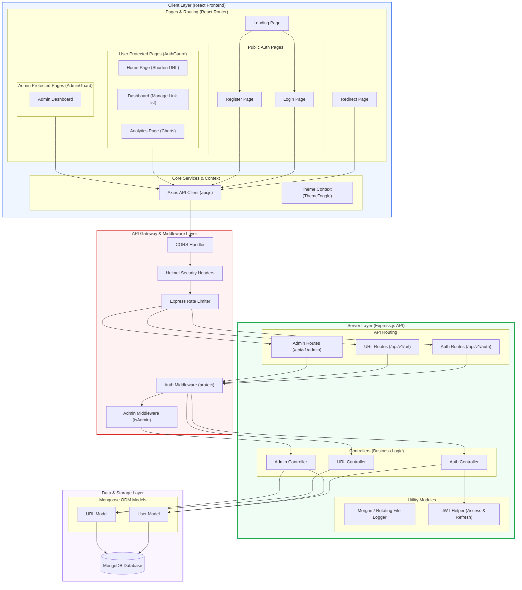
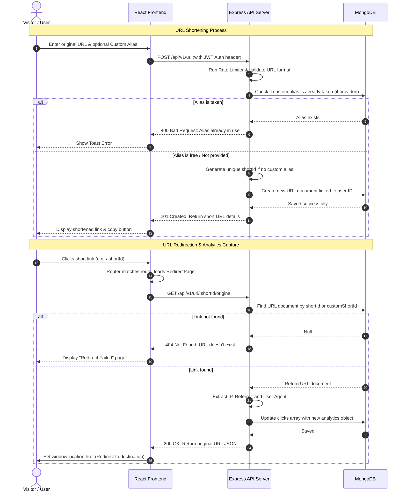

#  Advance URL Shortener

<p align="center">
  
</p>

<p align="center">
  A high-performance, responsive, full-stack URL shortening service featuring rich interactive analytics dashboards, role-based access control, system-wide administrative management, secure cookie-based session control, and class-based light/dark theme toggle support.
</p>

---

## 📋 Table of Contents

- [Overview](#overview)
- [Key Features](#key-features)
- [Tech Stack](#tech-stack)
- [System Architecture](#system-architecture)
- [Application Process Flows](#application-process-flows)
- [Project Directory Structure](#project-directory-structure)
- [Quick Start & Setup](#quick-start--setup)
- [Environment Variables](#environment-variables)
- [Usage Guide & Developer API](#usage-guide--developer-api)
- [Security & Data Protection](#security--data-protection)
- [Performance Optimizations](#performance-optimizations)
- [Production Deployment](#production-deployment)
- [Author & License](#author--license)

---

## 🔍 Overview

The **Advance URL Shortener** is a modern full-stack web application designed to simplify link management while delivering comprehensive tracking and analytics. Unlike basic shorteners, this application captures detailed telemetry (IP address, referrers, device/browser families, and hit timestamps) for every click. 

It provides an intuitive dashboard for standard users to manage their personal short links, a system-wide control panel for administrators, and a resilient developer REST API. The system has been fully optimized with cross-site cookie handling, rate limiting, and persistent dark/light styling.

---

## ✨ Key Features

### 🔗 Core URL Service
- **Instant Redirection**: Low-latency redirection to original target URLs.
- **Custom Links**: Support for custom user-defined short aliases (e.g., `/my-link`).
- **Bulk Dashboard**: Create, view, copy, and delete shortened URLs from a centralized dashboard.
- **Direct Redirection**: Dual redirect methods (Direct HTTP 302 or Client-side JSON fetching) to accommodate web clients and API consumers.

### 📊 Advanced Analytics
- **Telemetry Capture**: Logs click timestamp, visitor IP address, and browser referrer.
- **Visual Analytics**: Interactive dashboard with chart representations of link hits over time.
- **Audience Metrics**: Breakdown of traffic sources (referrers), unique visitors, and device distributions.
- **Unique Click Auditing**: Derives unique vs. total views automatically using IP identification.

### 🛡️ User & Session Management
- **Role-Based Authentication**: Secure login/registration supporting standard `user` and `admin` roles.
- **Refresh Token Rotation**: JWT-based session state with automatic token refresh via secure cookies.
- **Secure Logouts**: Immediate server and client session invalidation.

### ⚙️ System Administration
- **Admin Control Panel**: View global metrics, inspect all system-wide users, and moderate all shortened URLs.
- **Dual-Auth Admins**: Supports standard JWT sessions for the UI dashboard and Basic Auth headers (`adminBasicAuth`) for external automation/API tools.

### 🌓 Premium UX & Accessibility
- **Light/Dark Themes**: Fully responsive UI featuring a theme toggle with persistent state saved to `localStorage`.
- **Responsive Layouts**: Designed using Tailwind CSS to look premium on desktops, tablets, and smartphones.
- **Real-Time Toasts**: Prompt UI status updates and error notifications.

---

## 🛠️ Tech Stack

### Frontend Client
| Technology | Version | Purpose |
| :--- | :--- | :--- |
| **React** | 19.1.1 | Reactive component-based UI |
| **Vite** | 7.1.7 | High-speed frontend build tool and dev server |
| **Tailwind CSS** | 4.1.14 | Utility-first styling framework |
| **React Router** | 7.9.4 | Single Page Application (SPA) client routing |
| **Axios** | 1.12.2 | HTTP client with automatic JWT token refresh interceptors |
| **React Hot Toast** | 2.6.0 | Modern alert notification banners |
| **React Icons** | 5.5.0 | Premium SVG vector icon sets |

### Backend API Server
| Technology | Version | Purpose |
| :--- | :--- | :--- |
| **Node.js** | Latest | Server-side runtime environment |
| **Express.js** | 5.1.0 | RESTful API router framework |
| **MongoDB** | Latest | NoSQL document-based primary datastore |
| **Mongoose** | 8.19.0 | Object Document Mapper (ODM) for MongoDB schemas |
| **jsonwebtoken** | 9.0.2 | Signed JWT generation and verification |
| **bcryptjs** | 3.0.2 | Heavy-duty user password hashing (12 rounds) |
| **Helmet.js** | 8.1.0 | HTTP response security header configurations |
| **express-rate-limit**| 8.1.0 | Rate limiter to safeguard routes from DDoS and brute force |
| **Morgan** | 1.10.1 | Structured server HTTP request logging |

---

## 📐 System Architecture

This application employs a layered Architecture with a decoupled single-page frontend (React) and an API backend (Express + MongoDB).


```mermaid
graph TB
    subgraph Client ["Client Layer (React Frontend)"]
        subgraph Views ["Pages & Routing (React Router)"]
            LP["Landing Page"]
            RP["Redirect Page"]
            
            subgraph Public ["Public Auth Pages"]
                LGP["Login Page"]
                RGP["Register Page"]
            end
            
            subgraph UserProtected ["User Protected Pages (AuthGuard)"]
                HP["Home Page (Shorten URL)"]
                DB["Dashboard (Manage Link list)"]
                AP["Analytics Page (Charts)"]
            end
            
            subgraph AdminProtected ["Admin Protected Pages (AdminGuard)"]
                AD["Admin Dashboard"]
            end
        end
        
        subgraph Services ["Core Services & Context"]
            API["Axios API Client (api.js)"]
            TC["Theme Context (ThemeToggle)"]
        end
    end

    subgraph Security ["API Gateway & Middleware Layer"]
        CORS["CORS Handler"]
        HL["Helmet Security Headers"]
        RL["Express Rate Limiter"]
        AMW["Auth Middleware (protect)"]
        ADMW["Admin Middleware (isAdmin)"]
    end

    subgraph Server ["Server Layer (Express.js API)"]
        subgraph Routes ["API Routing"]
            AR["Auth Routes (/api/v1/auth)"]
            UR["URL Routes (/api/v1/url)"]
            ADR["Admin Routes (/api/v1/admin)"]
        end
        
        subgraph Controllers ["Controllers (Business Logic)"]
            AC["Auth Controller"]
            UC["URL Controller"]
            ADC["Admin Controller"]
        end
        
        subgraph Utilities ["Utility Modules"]
            LOG["Morgan / Rotating File Logger"]
            JWT["JWT Helper (Access & Refresh)"]
        end
    end

    subgraph Database ["Data & Storage Layer"]
        subgraph Mongoose ["Mongoose ODM Models"]
            UM["User Model"]
            URLM["URL Model"]
        end
        DB_STORE[("MongoDB Database")]
    end

    %% Client Interactions
    LP --> LGP
    LP --> RGP
    UserProtected --> API
    AdminProtected --> API
    RP --> API
    LGP --> API
    RGP --> API
    
    %% API requests flow
    API --> CORS
    CORS --> HL
    HL --> RL
    
    %% Routing to API
    RL --> AR
    RL --> UR
    RL --> ADR
    
    %% Route Guards and Authentication flow
    AR --> AMW
    UR --> AMW
    ADR --> AMW
    AMW --> ADMW
    
    %% Controller bindings
    AMW --> AC
    AMW --> UC
    ADMW --> ADC
    
    %% Utility helper utilization
    AC --> JWT
    
    %% Mongoose bindings
    AC --> UM
    UC --> URLM
    ADC --> UM
    ADC --> URLM
    
    %% Database persistence
    UM --> DB_STORE
    URLM --> DB_STORE
    
    style Client fill:#eff6ff,stroke:#2563eb,stroke-width:2px;
    style Security fill:#fef2f2,stroke:#dc2626,stroke-width:2px;
    style Server fill:#f0fdf4,stroke:#16a34a,stroke-width:2px;
    style Database fill:#faf5ff,stroke:#7c3aed,stroke-width:2px;
```

---

## 🔄 Application Process Flows

The diagrams below represent user-facing operations inside the application.

### URL Shortening & Redirect Sequence
This sequence details how links are generated and how hit analytics are recorded during click redirection.


```mermaid
sequenceDiagram
    autonumber
    actor User as Visitor / User
    participant FE as React Frontend
    participant BE as Express API Server
    participant DB as MongoDB
    
    Note over User, DB: URL Shortening Process
    User->>FE: Enter original URL & optional Custom Alias
    FE->>BE: POST /api/v1/url (with JWT Auth header)
    BE->>BE: Run Rate Limiter & validate URL format
    BE->>DB: Check if custom alias is already taken (if provided)
    alt Alias is taken
        DB-->>BE: Alias exists
        BE-->>FE: 400 Bad Request: Alias already in use
        FE-->>User: Show Toast Error
    else Alias is free / Not provided
        BE->>BE: Generate unique shortId if no custom alias
        BE->>DB: Create new URL document linked to user ID
        DB-->>BE: Saved successfully
        BE-->>FE: 201 Created: Return short URL details
        FE-->>User: Display shortened link & copy button
    end
    
    Note over User, DB: URL Redirection & Analytics Capture
    User->>FE: Clicks short link (e.g. /:shortId)
    FE->>FE: Router matches route, loads RedirectPage
    FE->>BE: GET /api/v1/url/:shortId/original
    BE->>DB: Find URL document by shortId or customShortId
    alt Link not found
        DB-->>BE: Null
        BE-->>FE: 404 Not Found: URL doesn't exist
        FE-->>User: Display "Redirect Failed" page
    else Link found
        DB-->>BE: Return URL document
        BE->>BE: Extract IP, Referrer, and User Agent
        BE->>DB: Update clicks array with new analytics object
        DB-->>BE: Saved
        BE-->>FE: 200 OK: Return original URL JSON
        FE->>User: Set window.location.href (Redirect to destination)
    end
```

---

## 📁 Project Directory Structure

```
Project-3/
├── frontend/                     # React Single Page Application (Client)
│   ├── public/                   # Static public assets
│   │   ├── Logo.png              # App Logo asset
│   │   ├── Favicon_p2.png        # Selected Favicon asset
│   │   └── vite.svg              # Build configuration utility icon
│   ├── src/
│   │   ├── components/           # Reusable Layout components
│   │   │   ├── Layout.jsx        # App Header, Navbar, & Sidebar framing wrapper
│   │   │   ├── Footer.jsx        # Footer component
│   │   │   ├── AuthGuard.jsx     # Route guard restricting pages to logged-in users
│   │   │   ├── AdminGuard.jsx    # Route guard restricting pages to administrators
│   │   │   └── ThemeToggle.jsx   # Header component for shifting Light/Dark modes
│   │   ├── context/              # Global React Context API states
│   │   │   └── ThemeContext.jsx  # Configures HTML class switches for dark themes
│   │   ├── pages/                # Route Page Views
│   │   │   ├── LandingPage.jsx   # Public landing gateway and product pitch
│   │   │   ├── LoginPage.jsx     # User authentication form (Login)
│   │   │   ├── RegisterPage.jsx  # User account creation form (Register)
│   │   │   ├── HomePage.jsx      # URL shortener submit form panel
│   │   │   ├── DashboardPage.jsx # Managed list of shortened links
│   │   │   ├── AnalyticsPage.jsx # Visual charts illustrating URL click metrics
│   │   │   ├── AdminDashboardPage.jsx # Control panel for administrative profiles
│   │   │   ├── RedirectPage.jsx  # Landing route mapping short URLs to redirects
│   │   │   └── NotFoundPage.jsx  # Fallback 404 error page
│   │   ├── api.js                # Axios configuration and backend request routes
│   │   ├── router.jsx            # React Router routing configuration
│   │   ├── App.jsx               # Top-level layout mapping router elements
│   │   ├── main.jsx              # Application build mount point
│   │   ├── App.css               # Global application CSS override settings
│   │   └── index.css             # Tailwind baseline style mappings
│   ├── package.json              # Front-end configuration properties and dependencies
│   ├── vite.config.mjs           # Vite development pipeline configuration
│   ├── tailwind.config.js        # Tailwind CSS styling layouts
│   └── vercel.json               # SPA routing configurations for Vercel deployment
│
├── backend/                      # Node/Express Server application (API)
│   ├── src/
│   │   ├── app.js                # Main Express setup (Cors, limits, global routing)
│   │   ├── server.js             # Mongo connection setup and server bootstrap
│   │   ├── config/               # Service environment configurations
│   │   │   ├── db.js             # Mongoose MongoDB connectivity setup
│   │   │   ├── env.js            # Environment validation checks
│   │   │   └── logger.js         # Morgan setup and daily error logs
│   │   ├── controllers/          # Request handler functions (Controller)
│   │   │   ├── auth.controller.js  # Registration, login, profile operations
│   │   │   ├── url.controller.js   # Shortener CRUD operations & redirection logic
│   │   │   └── admin.controller.js # Administrative control dashboards
│   │   ├── middlewares/          # Request filtration middlewares
│   │   │   ├── auth.middleware.js  # Token confirmation filters
│   │   │   ├── admin.middleware.js # Admin auth & administrative Basic Auth filters
│   │   │   └── error.middleware.js # Standard error catch-alls and formatters
│   │   ├── models/               # Mongoose DB schema definitions
│   │   │   ├── User.model.js     # User identities & role mappings
│   │   │   └── url.model.js      # Shortened URLs & click tracking arrays
│   │   ├── routes/               # API Router endpoints
│   │   │   ├── auth.route.js     # /api/v1/auth routes
│   │   │   ├── url.route.js      # /api/v1/url routes
│   │   │   └── admin.route.js    # /api/v1/admin routes
│   │   ├── utils/                # Server utilities
│   │   │   └── generateToken.js  # JWT cookie payload constructors
│   │   └── logs/                 # Self-generating rotation log files
│   ├── package.json              # Backend service configuration and dependencies
│   └── .env.example              # Sample environment configurations
│
├── DEPLOYMENT_FIX.md             # Guide clarifying production cookie policies
├── PRODUCTION_DEPLOYMENT.md      # Deployment walkthrough for Render and Vercel
├── README.md                     # Main project directory overview (This file)
└── LICENSE.md                    # GNU General Public License Version 3 document
```

---

## ⚡ Quick Start & Setup

### Prerequisites
- **Node.js** (v18.0.0 or higher)
- **MongoDB** (v6.0 or higher running locally or hosted on MongoDB Atlas)
- **Git**

### Installation Steps

1. **Clone the Repository**
   ```bash
   git clone <repository-url>
   cd Project-3
   ```

2. **Backend Service Initialisation**
   ```bash
   cd backend
   npm install
   
   # Duplicate the sample environment settings
   cp .env.example .env
   # Edit .env to supply your personal database and token credentials (see Environment section)

   # Launch the API Server in development mode
   npm run backend
   ```
   *The server runs on `http://localhost:9000`.*

3. **Frontend Client Initialisation**
   ```bash
   cd ../frontend
   npm install
   
   # Launch the Vite Client server
   npm run dev
   ```
   *The frontend client runs on `http://localhost:5173`.*

4. **Verify Application Health**
   - Access the Client dashboard at `http://localhost:5173`.
   - Access the backend server health check at `http://localhost:9000/health`.

---

## 🔑 Environment Variables

To run the project, create `.env` files in both frontend and backend root folders. Do **not** commit these files to version control.

### Backend Configurations (`backend/.env`)
```properties
# App Execution Settings
PORT=9000
NODE_ENV=development

# Database Configurations
MONGO_URI=mongodb://localhost:27017/url-shortener
DB_NAME=url-shortener

# JSON Web Tokens (Access Secrets & Lifespans)
JWT_SECRET=super_secret_master_key_change_in_production
JWT_EXPIRES=7d
JWT_ACCESS_SECRET=access_token_encryption_key_change_in_production
JWT_ACCESS_EXPIRES_IN=15m
JWT_REFRESH_SECRET=refresh_token_encryption_key_change_in_production
JWT_REFRESH_EXPIRES_IN=7d

# Rate Limiter & Security Params
BCRYPT_ROUNDS=12
RATE_LIMIT_WINDOW_MS=900000     # 15 minutes in milliseconds
RATE_LIMIT_MAX_REQUESTS=100     # Limit each IP to 100 requests per window

# Cross-Origin Policies (No Trailing Slashes)
FRONTEND_URL=http://localhost:5173
BACKEND_URL=http://localhost:9000
```

### Frontend Configurations (`frontend/.env.production`)
When building for production, set this environment configuration:
```properties
VITE_API_URL=https://your-backend-domain.com/api/v1
```
*Note: During local development, the Vite server uses built-in proxies configured in `vite.config.mjs` to direct requests to the local backend port without manual `.env` files.*

---

## 📖 Usage Guide & Developer API

### Generating custom short URLs (REST API)
To programmatically generate short URLs, make an authenticated POST request:

```http
POST /api/v1/url
Authorization: Bearer <your_jwt_access_token>
Content-Type: application/json

{
  "originalUrl": "https://developer.mozilla.org/en-US/docs/Web/HTTP",
  "customShortId": "mdn-http"
}
```

#### JSON Response (201 Created):
```json
{
  "success": true,
  "message": "URL shortened successfully",
  "data": {
    "originalUrl": "https://developer.mozilla.org/en-US/docs/Web/HTTP",
    "shortId": "mdn-http",
    "customShortId": "mdn-http",
    "_id": "603dcd75df7b69324888cf3c",
    "clicks": [],
    "user": "603dcbf1df7b69324888cf32",
    "createdAt": "2026-06-21T09:00:00.000Z",
    "updatedAt": "2026-06-21T09:00:00.000Z",
    "shortUrl": "http://localhost:5173/mdn-http"
  }
}
```

---

## 🛡️ Security & Data Protection

### SameSite Cookies in Cross-Site Deployments
When separating client hosts (Vercel) from API servers (Render), modern browsers block traditional cookies. We fixed this issue in `backend/src/utils/generateToken.js` with dynamic environment setups:
- **Local Dev**: Configures `SameSite: 'Lax'` and `Secure: false` to allow localhost testing.
- **Production**: Configures `SameSite: 'None'` and `Secure: true` with `HttpOnly: true`. This allows cross-site authentication transmissions while protecting cookies from XSS (Cross-Site Scripting).

### Route Access Rules
- **Rate Limit Safeguards**: Configured via `express-rate-limit` to prevent brute force requests on login/auth portals and API spamming.
- **Helmet Headers**: Injects key security headers preventing clickjacking, MIME sniffing, and cross-site scripting vulnerabilities.

---

## 📈 Performance Optimizations

- **MongoDB Indexing**: Database indexes are defined on `shortId` (unique), `customShortId` (unique, sparse), and `user` (ref relation lookup) to ensure queries remain fast as records grow.
- **React Lazy Loading & Transitions**: Heavy page elements use lazy routes and transition APIs (`v7_startTransition`) to speed up loading and keep transitions smooth.
- **Daily Rotation Logs**: Morgan request logs use stream rotators to keep server logs structured without wasting disk space.

<!-- ---

## 🚀 Production Deployment

Refer to [PRODUCTION_DEPLOYMENT.md](./PRODUCTION_DEPLOYMENT.md) and [DEPLOYMENT_FIX.md](./DEPLOYMENT_FIX.md) for complete step-by-step setup guides on Render and Vercel. -->

---

## 📄 License & Author

- **Author**: Amritanshu Goutam
  - LinkedIn: [Amritanshu Goutam](https://www.linkedin.com/in/amritanshu-goutam/)
  - GitHub: [amritanshu-goutam](https://github.com/bhutuklearning)
  - Twitter/X: [Amritanshutwt](https://x.com/Amritanshutwt)

- **License**: This project is licensed under the [GNU General Public License v3.0](./LICENSE.md).

---
<!-- *Built and maintained with a focus on stable, clean design and reliable operations.* -->
*Started this project as learning and want to make it in such a way such that people find usefullness of this application*