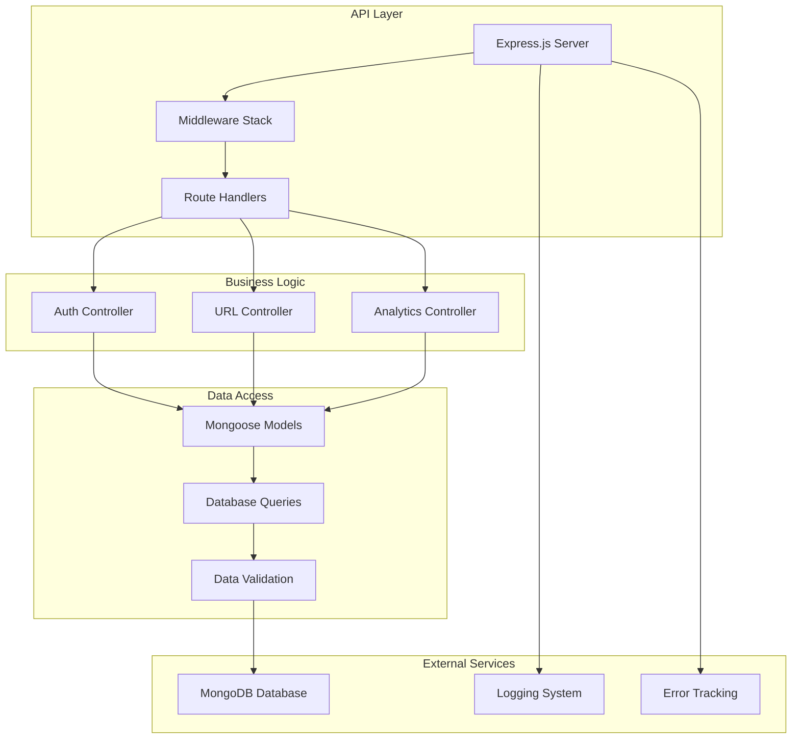

# 🔧 URL Shortener API

<div align="center">


A robust, scalable REST API for URL shortening with comprehensive analytics and user management.

[](https://your-api-url.com/health)
[](./API.md)

</div>

## 📋 Table of Contents

- [✨ Features](#-features)
- [🛠️ Tech Stack](#️-tech-stack)
- [🏗️ Architecture](#️-architecture)
- [🚀 Quick Start](#-quick-start)
- [📚 API Documentation](#-api-documentation)
- [🔒 Security](#-security)
- [📊 Performance](#-performance)
- [🌐 Deployment](#-deployment)


## Features

### Core API Features

- **URL Shortening**: Create short URLs with auto-generated or custom IDs
- **URL Redirection**: Efficient redirect handling with click tracking
- **User Authentication**: JWT-based auth with refresh tokens
- **Analytics**: Comprehensive click tracking and statistics
- **Rate Limiting**: Configurable API rate limits
- **Error Handling**: Centralized error management

### Authentication & Authorization

- **JWT Tokens**: Secure token-based authentication
- **Refresh Tokens**: Automatic token renewal system
- **Password Security**: bcrypt hashing with salt rounds
- **Session Management**: Secure logout and token cleanup
- **Protected Routes**: Middleware-based route protection

###  Analytics & Monitoring

- **Click Tracking**: Track every URL click with metadata
- **Referrer Analysis**: Monitor traffic sources
- **Geographic Data**: Location-based analytics
- **Time-based Stats**: Track performance over time
- **User Analytics**: Per-user URL statistics

### Security Features

- **Helmet.js**: Security headers implementation
- **CORS Protection**: Configurable cross-origin policies
- **Input Validation**: Comprehensive request validation
- **SQL Injection Protection**: Parameterized queries
- **Rate Limiting**: DDoS and abuse prevention

## Tech Stack

| Category           | Technology         | Version | Purpose                   |
| ------------------ | ------------------ | ------- | ------------------------- |
| **Runtime**        | Node.js            | Latest  | JavaScript runtime        |
| **Framework**      | Express.js         | 5.1.0   | Web application framework |
| **Database**       | MongoDB            | Latest  | NoSQL database            |
| **ODM**            | Mongoose           | 8.19.0  | MongoDB object modeling   |
| **Authentication** | JWT                | 9.0.2   | JSON Web Tokens           |
| **Security**       | bcryptjs           | 3.0.2   | Password hashing          |
| **Security**       | Helmet             | 8.1.0   | Security headers          |
| **Logging**        | Morgan             | 1.10.1  | HTTP request logger       |
| **Rate Limiting**  | express-rate-limit | 8.1.0   | API rate limiting         |
| **Development**    | Nodemon            | 3.1.10  | Development hot reload    |

## 🏗️ Architecture



### Project Structure

```
backend/
├── 📁 src/
│   ├── 📄 app.js                 # Express app configuration
│   ├── 📄 server.js              # Server entry point
│   │
│   ├── 📁 config/                # Configuration files
│   │   ├── 📄 db.js              # Database connection
│   │   ├── 📄 env.js             # Environment variables
│   │   └── 📄 logger.js          # Logging configuration
│   │
│   ├── 📁 controllers/           # Request handlers
│   │   ├── 📄 auth.controller.js # Authentication logic
│   │   └── 📄 url.controller.js  # URL shortening logic
│   │
│   ├── 📁 middlewares/           # Express middlewares
│   │   ├── 📄 auth.middleware.js # Authentication middleware
│   │   └── 📄 error.middleware.js# Error handling middleware
│   │
│   ├── 📁 models/                # Database models
│   │   ├── 📄 User.model.js      # User schema and model
│   │   └── 📄 url.model.js       # URL schema and model
│   │
│   ├── 📁 routes/                # API routes
│   │   ├── 📄 auth.route.js      # Authentication routes
│   │   └── 📄 url.route.js       # URL shortening routes
│   │
│   ├── 📁 utils/                 # Utility functions
│   │   └── 📄 generateToken.js   # JWT token generation
│   │
│   └── 📁 logs/                  # Application logs
│       ├── 📁 development/       # Dev environment logs
│       └── 📁 production/        # Production environment logs
│
├── 📄 package.json               # Dependencies and scripts
├── 📄 .env.example               # Environment variables template
└── 📄 README.md                  # This file
```

## Quick Start

### Prerequisites

- **Node.js** (v18 or higher)
- **MongoDB** (v6 or higher)
- **npm** or **yarn**

### Installation

1. **Clone and navigate to backend**

   ```bash
   git clone https://github.com/yourusername/url-shortener.git
   cd url-shortener/backend
   ```

2. **Install dependencies**

   ```bash
   npm install
   ```

3. **Environment setup**

   ```bash
   # Copy environment template
   cp .env.example .env

   # Edit .env with your configuration
   nano .env
   ```

4. **Start the server**

   ```bash
   # Development mode with hot reloading
   npm run backend

   # Production mode
   npm start
   ```

### Environment Variables

Create a `.env` file in the backend root directory:

```env
# Server Configuration
PORT=5000
NODE_ENV=development

# Database Configuration
MONGODB_URI=mongodb://localhost:27017/url-shortener

# JWT Configuration
JWT_SECRET=your-super-secret-jwt-key-here
JWT_EXPIRE=7d
JWT_REFRESH_SECRET=your-refresh-token-secret-here
JWT_REFRESH_EXPIRE=30d

# Security Configuration
BCRYPT_ROUNDS=12
RATE_LIMIT_WINDOW_MS=900000
RATE_LIMIT_MAX_REQUESTS=100

# CORS Configuration
FRONTEND_URL=http://localhost:5173
ALLOWED_ORIGINS=http://localhost:5173,https://yourdomain.com

# Logging Configuration
LOG_LEVEL=info
LOG_FILE_MAX_SIZE=10m
LOG_FILE_MAX_FILES=5
```

## API Documentation

### Base URL

```
Development: http://localhost:5000/api/v1
Production: https://your-api-domain.com/api/v1
```

### Authentication Endpoints

#### Register User

```http
POST /api/v1/auth/register
Content-Type: application/json

{
  "userName": "johndoe",
  "email": "john@example.com",
  "password": "securepassword123"
}
```

**Response:**

```json
{
  "success": true,
  "message": "User registered successfully",
  "data": {
    "user": {
      "id": "user_id",
      "userName": "johndoe",
      "email": "john@example.com"
    },
    "accessToken": "jwt_access_token",
    "refreshToken": "jwt_refresh_token"
  }
}
```

#### Login User

```http
POST /api/v1/auth/login
Content-Type: application/json

{
  "email": "john@example.com",
  "password": "securepassword123"
}
```

**Response:**

```json
{
  "success": true,
  "message": "Login successful",
  "data": {
    "user": {
      "id": "user_id",
      "userName": "johndoe",
      "email": "john@example.com"
    },
    "accessToken": "jwt_access_token",
    "refreshToken": "jwt_refresh_token"
  }
}
```

#### Refresh Token

```http
POST /api/v1/auth/refresh-token
Content-Type: application/json

{
  "refreshToken": "jwt_refresh_token"
}
```

#### Get User Profile

```http
GET /api/v1/auth/profile
Authorization: Bearer jwt_access_token
```

#### Logout

```http
POST /api/v1/auth/logout
Authorization: Bearer jwt_access_token
```

### URL Shortening Endpoints

#### Create Short URL

```http
POST /api/v1/urls
Authorization: Bearer jwt_access_token
Content-Type: application/json

{
  "originalUrl": "https://example.com/very-long-url",
  "customShortId": "my-custom-link"
}
```

**Response:**

```json
{
  "success": true,
  "data": {
    "shortId": "my-custom-link",
    "shortUrl": "https://yourdomain.com/my-custom-link",
    "originalUrl": "https://example.com/very-long-url",
    "createdAt": "2024-01-20T10:30:00.000Z"
  }
}
```

#### Get User's URLs

```http
GET /api/v1/urls
Authorization: Bearer jwt_access_token
```

**Response:**

```json
{
  "success": true,
  "data": [
    {
      "shortId": "abc123",
      "shortUrl": "https://yourdomain.com/abc123",
      "originalUrl": "https://example.com/long-url",
      "clicks": 42,
      "createdAt": "2024-01-20T10:30:00.000Z"
    }
  ]
}
```

#### Redirect to Original URL

```http
GET /api/v1/urls/:shortId
```

**Response:** HTTP 302 Redirect to original URL

#### Get URL Analytics

```http
GET /api/v1/urls/stats/:shortId
Authorization: Bearer jwt_access_token
```

**Response:**

```json
{
  "success": true,
  "data": {
    "shortId": "abc123",
    "originalUrl": "https://example.com/long-url",
    "totalClicks": 42,
    "clicks": [
      {
        "timestamp": "2024-01-20T10:30:00.000Z",
        "referrer": "https://google.com",
        "ip": "192.168.1.1"
      }
    ],
    "createdAt": "2024-01-20T10:30:00.000Z"
  }
}
```


### Error Responses

All endpoints return consistent error responses:

```json
{
  "success": false,
  "error": "Error message",
  "code": "ERROR_CODE",
  "details": "Additional error details"
}
```

**Common HTTP Status Codes:**

- `200` - Success
- `201` - Created
- `400` - Bad Request
- `401` - Unauthorized
- `403` - Forbidden
- `404` - Not Found
- `429` - Too Many Requests
- `500` - Internal Server Error

## Security

### Authentication Security

- **JWT Tokens**: Secure token-based authentication
- **Refresh Tokens**: Automatic token renewal
- **Password Hashing**: bcrypt with configurable salt rounds
- **Token Expiration**: Configurable token lifetimes
- **Secure Cookies**: HttpOnly and Secure flags

### API Security

- **Rate Limiting**: Configurable per-IP rate limits
- **CORS Protection**: Restrictive cross-origin policies
- **Helmet.js**: Security headers implementation
- **Input Validation**: Comprehensive request validation

### Data Protection

- **Environment Variables**: Sensitive data protection
- **HTTPS Only**: All communications encrypted
- **Data Sanitization**: XSS prevention
- **Error Handling**: Sanitized error messages

## Performance

### Database Optimizations

<!-- - **Indexing**: Optimized database indexes for queries -->
- **Connection Pooling**: Efficient MongoDB connections
- **Query Optimization**: Optimized Mongoose queries
<!-- - **Data Aggregation**: Efficient analytics queries -->


### Monitoring

- **Performance Metrics**: Response time tracking
- **Error Monitoring**: Comprehensive error logging
- **Health Checks**: Automated system monitoring
- **Resource Usage**: Memory and CPU monitoring


## 🌐 Deployment

### Environment Setup

- **Production Database**: MongoDB Atlas
- **Environment Variables**: Secure configuration
- **SSL Certificates**: HTTPS configuration
- **Domain Configuration**: Custom domain setup

### Deployment Platforms

#### Render

```bash
# Connect GitHub repository
# Set environment variables
# Deploy automatically on push
```

#### Railway

```bash
# Install Railway CLI
npm install -g @railway/cli

# Login and deploy
railway login
railway deploy
```

#### Heroku

```bash
# Install Heroku CLI
# Create Heroku app
heroku create your-app-name

# Set environment variables
heroku config:set NODE_ENV=production
heroku config:set MONGODB_URI=your-mongodb-uri

# Deploy
git push heroku main
```

### Production Checklist

- Environment variables configured
- Database connection established
- SSL certificates installed
- Rate limiting configured
- Logging configured
- Error monitoring setup
- Health checks implemented


## Monitoring & Logging

### Logging Configuration

- **Development**: Colorized console output
- **Production**: Structured JSON logs
- **Log Rotation**: Automatic log file rotation
- **Log Levels**: Configurable log levels

### Health Checks

```http
GET /health
```

**Response:**

```json
{
  "status": "healthy",
  "timestamp": "2024-01-20T10:30:00.000Z",
  "uptime": 3600,
  "database": "connected",
  "memory": {
    "used": "50MB",
    "free": "200MB"
  }
}
```

### Error Tracking

- **Error Logging**: Comprehensive error logging
- **Stack Traces**: Detailed error information
- **Error Classification**: Categorized error types

---

<div align="center">

**Built with ❤️ using Node.js and Express**

</div>
