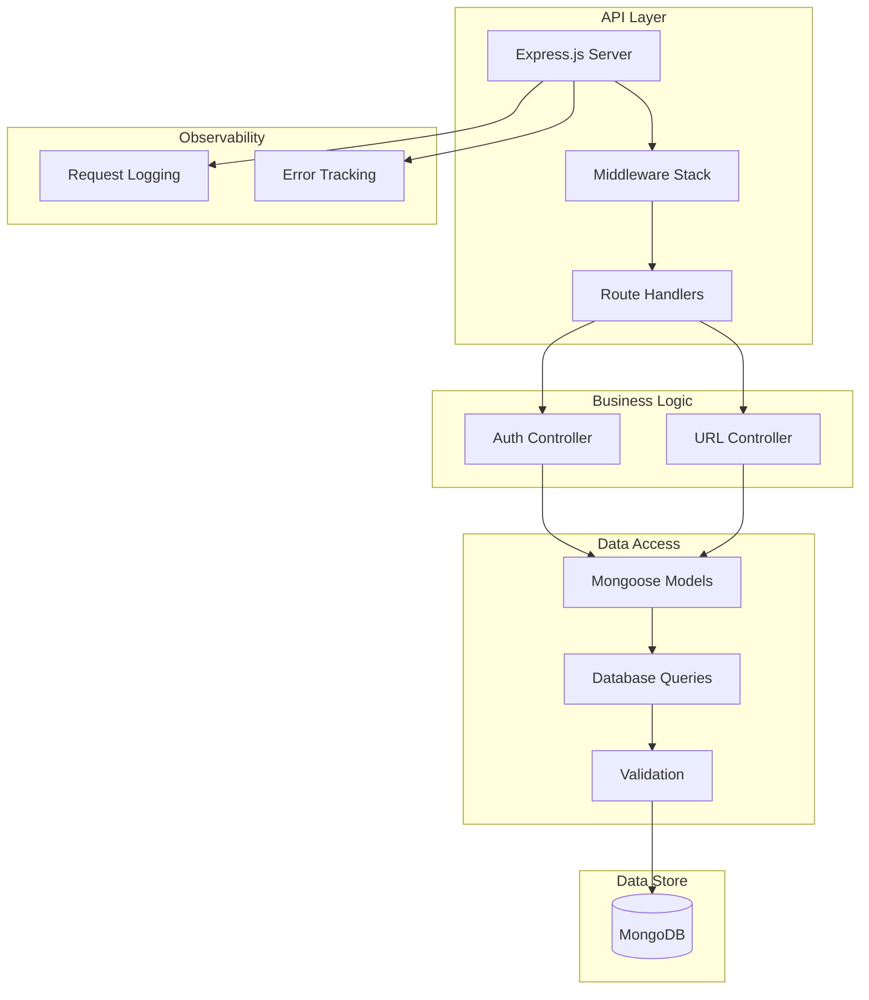

# URL Shortener API

<div align="center">


A robust REST API for URL shortening, user management, and click analytics.

</div>

## Table of Contents

- [Overview](#overview)
- [Features](#features)
- [Tech Stack](#tech-stack)
- [Architecture](#architecture)
- [Project Structure](#project-structure)
- [Quick Start](#quick-start)
- [Environment Variables](#environment-variables)
- [API Documentation](#api-documentation)
- [Error Responses](#error-responses)
- [Security](#security)
- [Performance](#performance)
- [Deployment](#deployment)
- [Monitoring and Logging](#monitoring-and-logging)
- [Health Checks](#health-checks)

## Overview

This backend service powers a production-ready URL shortener. It provides secure authentication, configurable rate limiting, detailed click capture, and deployment-friendly observability. The codebase is built with Express 5 and MongoDB (via Mongoose) and follows a layered architecture separating routing, controllers, and data access concerns.

## Features

### Core API Features

- **URL Shortening**: Create short URLs with auto-generated or custom IDs
- **URL Redirection**: Efficient redirect handling with click tracking
- **User Authentication**: JWT-based auth with refresh tokens
- **Click Capture**: Persist timestamp, referrer, and IP metadata for each redirect
- **Rate Limiting**: Configurable API rate limits
- **Error Handling**: Centralized error management

### Authentication & Authorization

- **JWT Tokens**: Secure token-based authentication
- **Refresh Tokens**: Automatic token renewal system
- **Password Security**: bcrypt hashing with salt rounds
- **Session Management**: Secure logout and token cleanup
- **Protected Routes**: Middleware-based route protection

### Analytics and Reporting

- **Click History**: Access full click records per URL, including timestamp, IP, and referrer
- **Unique Clicks**: Derive unique visitor counts based on captured IP addresses
- **User-Level Views**: Retrieve URL lists and analytics scoped to the authenticated user

### Security Features

- **Helmet.js**: Security headers implementation
- **CORS Protection**: Configurable cross-origin policies
- **Input Validation**: Comprehensive request validation
- **Rate Limiting**: DDoS and abuse prevention
- **Cookie Management**: HttpOnly cookies with environment-aware SameSite settings

## Tech Stack

| Category           | Technology         | Version | Purpose                   |
| ------------------ | ------------------ | ------- | ------------------------- |
| **Runtime**        | Node.js            | Latest  | JavaScript runtime        |
| **Framework**      | Express.js         | 5.1.0   | Web application framework |
| **Database**       | MongoDB            | Latest  | NoSQL database            |
| **ODM**            | Mongoose           | 8.19.0  | MongoDB object modeling   |
| **Authentication** | JWT                | 9.0.2   | JSON Web Tokens           |
| **Security**       | bcryptjs           | 3.0.2   | Password hashing          |
| **Security**       | Helmet             | 8.1.0   | Security headers          |
| **Logging**        | Morgan             | 1.10.1  | HTTP request logger       |
| **Rate Limiting**  | express-rate-limit | 8.1.0   | API rate limiting         |
| **Development**    | Nodemon            | 3.1.10  | Development hot reload    |

## Architecture



## Project Structure

```
backend/
├── src/
│   ├── app.js                 # Express app configuration
│   ├── server.js              # Server entry point
│   ├── config/                # Configuration files
│   │   ├── db.js              # Database connection
│   │   ├── env.js             # Environment variables
│   │   └── logger.js          # Logging configuration
│   ├── controllers/           # Request handlers
│   │   ├── auth.controller.js # Authentication logic
│   │   └── url.controller.js  # URL shortening logic
│   ├── middlewares/           # Express middlewares
│   │   ├── auth.middleware.js # Authentication middleware
│   │   └── error.middleware.js# Error handling middleware
│   ├── models/                # Database models
│   │   ├── User.model.js      # User schema and model
│   │   └── url.model.js       # URL schema and model
│   ├── routes/                # API routes
│   │   ├── auth.route.js      # Authentication routes
│   │   └── url.route.js       # URL shortening routes
│   ├── utils/                 # Utility functions
│   │   └── generateToken.js   # JWT token generation
│   └── logs/                  # Application logs
│       ├── development/       # Dev environment logs
│       └── production/        # Production environment logs
├── package.json               # Dependencies and scripts
├── .env.example               # Environment variables template
└── README.md                  # Documentation
```

## Quick Start

### Prerequisites

- **Node.js** (v18 or higher)
- **MongoDB** (v6 or higher)
- **npm** or **yarn**

### Installation

1. **Clone and navigate to backend**

   ```bash
   git clone https://github.com/yourusername/url-shortener.git
   cd url-shortener/backend
   ```

2. **Install dependencies**

   ```bash
   npm install
   ```

3. **Environment setup**

   Copy the sample environment file and update it with your configuration:

   ```bash
   # macOS / Linux
   cp .env.example .env
   ```

   ```powershell
   # Windows PowerShell
   Copy-Item .env.example .env
   ```

   Edit `.env` in your preferred editor (for example VS Code, Notepad, or nano).

4. **Start the server**

   ```bash
   # Development mode with hot reloading
   npm run backend

   # Production mode
   npm start
   ```

## Environment Variables

Create a `.env` file in the backend root directory:

```env
# Server Configuration
PORT=5000
NODE_ENV=development

# Database Configuration
MONGODB_URI=mongodb://localhost:27017/url-shortener

# JWT Configuration
JWT_SECRET=your-super-secret-jwt-key-here
JWT_EXPIRE=7d
JWT_REFRESH_SECRET=your-refresh-token-secret-here
JWT_REFRESH_EXPIRE=30d

# Security Configuration
BCRYPT_ROUNDS=12
RATE_LIMIT_WINDOW_MS=900000
RATE_LIMIT_MAX_REQUESTS=100

# CORS Configuration
FRONTEND_URL=http://localhost:5173
ALLOWED_ORIGINS=http://localhost:5173,https://yourdomain.com

# Logging Configuration
LOG_LEVEL=info
LOG_FILE_MAX_SIZE=10m
LOG_FILE_MAX_FILES=5
```

## API Documentation

### Base URL

```
Development: http://localhost:5000/api/v1
Production: https://<your-domain>/api/v1
```

### Authentication Endpoints

#### Register User

```http
POST /api/v1/auth/register
Content-Type: application/json

{
  "userName": "johndoe",
  "email": "john@example.com",
  "password": "securepassword123"
}
```

**Response:**

```json
{
  "success": true,
  "message": "User registered successfully",
  "data": {
    "user": {
      "id": "user_id",
      "userName": "johndoe",
      "email": "john@example.com"
    },
    "accessToken": "jwt_access_token",
    "refreshToken": "jwt_refresh_token"
  }
}
```

#### Login User

```http
POST /api/v1/auth/login
Content-Type: application/json

{
  "email": "john@example.com",
  "password": "securepassword123"
}
```

**Response:**

```json
{
  "success": true,
  "message": "Login successful",
  "data": {
    "user": {
      "id": "user_id",
      "userName": "johndoe",
      "email": "john@example.com"
    },
    "accessToken": "jwt_access_token",
    "refreshToken": "jwt_refresh_token"
  }
}
```

#### Refresh Token

```http
POST /api/v1/auth/refresh-token
Content-Type: application/json

{
  "refreshToken": "jwt_refresh_token"
}
```

#### Get User Profile

```http
GET /api/v1/auth/profile
Authorization: Bearer jwt_access_token
```

#### Logout

```http
POST /api/v1/auth/logout
Authorization: Bearer jwt_access_token
```

### URL Shortening Endpoints

#### Create Short URL

```http
POST /api/v1/urls
Authorization: Bearer jwt_access_token
Content-Type: application/json

{
  "originalUrl": "https://example.com/very-long-url",
  "customShortId": "my-custom-link"
}
```

**Response:**

```json
{
  "success": true,
  "data": {
    "shortId": "my-custom-link",
    "shortUrl": "https://yourdomain.com/my-custom-link",
    "originalUrl": "https://example.com/very-long-url",
    "createdAt": "2024-01-20T10:30:00.000Z"
  }
}
```

#### Get User's URLs

```http
GET /api/v1/urls
Authorization: Bearer jwt_access_token
```

**Response:**

```json
{
  "success": true,
  "data": [
    {
      "shortId": "abc123",
      "shortUrl": "https://yourdomain.com/abc123",
      "originalUrl": "https://example.com/long-url",
      "clicks": 42,
      "createdAt": "2024-01-20T10:30:00.000Z"
    }
  ]
}
```

#### Redirect to Original URL

```http
GET /api/v1/urls/:shortId
```

**Response:** HTTP 302 Redirect to original URL

#### Get URL Analytics

```http
GET /api/v1/urls/stats/:shortId
Authorization: Bearer jwt_access_token
```

**Response:**

```json
{
  "success": true,
  "data": {
    "clicks": 42,
    "uniqueClicks": 38,
    "referrers": ["https://google.com", "Direct"],
    "details": [
      {
        "timestamp": "2024-01-20T10:30:00.000Z",
        "referrer": "https://google.com",
        "ip": "192.168.1.1"
      }
    ]
  }
}
```

## Error Responses

All endpoints return a consistent structure on error:

```json
{
  "success": false,
  "error": "Invalid refresh token"
}
```

When `NODE_ENV` is `development`, the response also includes a stack trace and additional metadata to help with debugging.

**Common HTTP Status Codes:**

- `200` - Success
- `201` - Created
- `400` - Bad Request
- `401` - Unauthorized
- `403` - Forbidden
- `404` - Not Found
- `429` - Too Many Requests
- `500` - Internal Server Error

## Security

### Authentication Security

- **JWT Tokens**: Secure token-based authentication
- **Refresh Tokens**: Automatic token renewal
- **Password Hashing**: bcrypt with configurable salt rounds
- **Token Expiration**: Configurable token lifetimes
- **Secure Cookies**: HttpOnly and Secure flags

### API Security

- **Rate Limiting**: Configurable per-IP rate limits
- **CORS Protection**: Restrictive cross-origin policies
- **Helmet.js**: Security headers implementation
- **Input Validation**: Comprehensive request validation

### Data Protection

- **Environment Variables**: Sensitive configuration kept out of version control
- **Secure Cookies**: HttpOnly cookies with SameSite/secure flags based on environment
- **HTTPS Recommended**: Deploy behind TLS to encrypt transport-level communication
- **Error Handling**: Centralized handler avoids leaking stack traces in production

## Performance

### Database

- **Connection Pooling**: Managed by Mongoose to reuse sockets efficiently
- **Unique Indexes**: Enforced on `shortId` and `customShortId` for fast lookups and integrity

### API Safeguards

- **Rate Limiting**: Multiple limiters to guard hot endpoints against bursts
- **Lightweight Controllers**: Async route handlers minimize blocking operations
- **Structured Logging**: Request and error logs assist with latency analysis

## Deployment

### Environment Setup

- **Production Database**: MongoDB Atlas
- **Environment Variables**: Secure configuration
- **SSL Certificates**: HTTPS configuration
- **Domain Configuration**: Custom domain setup

### Deployment Platforms

#### Render

```bash
# Connect GitHub repository
# Set environment variables
# Deploy automatically on push
```

#### Railway

```bash
# Install Railway CLI
npm install -g @railway/cli

# Login and deploy
railway login
railway deploy
```

#### Heroku

```bash
# Install Heroku CLI
# Create Heroku app
heroku create your-app-name

# Set environment variables
heroku config:set NODE_ENV=production
heroku config:set MONGODB_URI=your-mongodb-uri

# Deploy
git push heroku main
```

### Production Checklist

- Environment variables configured
- Database connection established
- SSL certificates installed
- Rate limiting configured
- Logging configured
- Error monitoring setup
- Health checks implemented

## Monitoring and Logging

### Logging Configuration

- **Development**: Colorized console output
- **Production**: Structured JSON logs
- **Log Rotation**: Automatic log file rotation
- **Log Levels**: Configurable log levels

### Error Tracking

- **Error Logging**: Comprehensive error logging
- **Stack Traces**: Detailed error information
- **Error Classification**: Categorized error types

## Health Checks

```http
GET /health
```

**Response:**

```json
{
  "status": "OK"
}
```

The health endpoint is lightweight and suitable for load balancers or uptime monitors.

---

Built with Node.js and Express.
