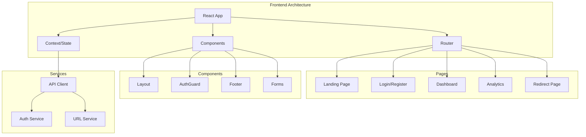

# 🎨 URL Shortener Frontend

<div align="center">


A modern, responsive React frontend for the URL Shortener application with authentication, analytics, and beautiful UI.

[](https://your-frontend-url.com)
[](https://vercel.com)

</div>

## 📋 Table of Contents

- [✨ Features](#-features)
- [🛠️ Tech Stack](#️-tech-stack)
- [🏗️ Architecture](#️-architecture)
- [🚀 Quick Start](#-quick-start)
- [📱 Pages & Components](#-pages--components)
- [🔧 Configuration](#-configuration)
- [🌐 Deployment](#-deployment)
- [🎨 Styling](#-styling)
- [🧪 Testing](#-testing)
- [📊 Performance](#-performance)

## ✨ Features

### Core Functionality

- **URL Shortening**: Create short URLs with custom aliases
- **User Dashboard**: Manage all your shortened URLs
- **Analytics Dashboard**: Track clicks and performance metrics
- **QR Code Generation**: Generate QR codes for easy sharing
- **Bulk Operations**: Manage multiple URLs efficiently

### Authentication & Security

- **Secure Login/Register**: JWT-based authentication
- **Protected Routes**: Route guards for authenticated users
- **Session Management**: Automatic token refresh
- **Secure Logout**: Complete session cleanup
- **Password Validation**: Strong password requirements

### Analytics & Tracking

- **Click Analytics**: Visual charts and metrics
- **Referrer Tracking**: Monitor traffic sources
- **Time-based Stats**: Track performance over time
- **Real-time Updates**: Live data refresh

### User Experience

- **Responsive Design**: Works on all devices
- **Dark/Light Mode**: Theme switching capability
- **Toast Notifications**: User feedback system
- **Loading States**: Smooth loading animations
- **Error Handling**: User-friendly error messages

## Tech Stack

| Category          | Technology      | Version | Purpose                     |
| ----------------- | --------------- | ------- | --------------------------- |
| **Framework**     | React           | 19.1.1  | UI Framework                |
| **Build Tool**    | Vite            | 7.1.7   | Build tool and dev server   |
| **Styling**       | Tailwind CSS    | 4.1.14  | Utility-first CSS framework |
| **Routing**       | React Router    | 7.9.4   | Client-side routing         |
| **HTTP Client**   | Axios           | 1.12.2  | API communication           |
| **Notifications** | React Hot Toast | 2.6.0   | Toast notifications         |
| **Icons**         | React Icons     | 5.5.0   | Icon library                |
| **Environment**   | dotenv          | 17.2.3  | Environment variables       |

### Development Tools

| Tool                  | Version | Purpose                  |
| --------------------- | ------- | ------------------------ |
| **ESLint**            | 9.36.0  | Code linting             |
| **Prettier**          | Latest  | Code formatting          |
| **Vite Plugin React** | 5.0.4   | React support for Vite   |

## 🏗️ Architecture



### Project Structure

```
frontend/
├── 📁 public/                    # Static assets
│   ├── 📄 logo.svg              # App logo
│   └── 📄 vite.svg              # Vite logo
│
├── 📁 src/
│   ├── 📁 components/            # Reusable components
│   │   ├── 📄 AuthGuard.jsx      # Route protection
│   │   ├── 📄 Footer.jsx         # Footer component
│   │   └── 📄 Layout.jsx         # Main layout wrapper
│   │
│   ├── 📁 pages/                 # Page components
│   │   ├── 📄 AnalyticsPage.jsx  # Analytics dashboard
│   │   ├── 📄 DashboardPage.jsx  # User dashboard
│   │   ├── 📄 HomePage.jsx       # Home page
│   │   ├── 📄 LandingPage.jsx   # Landing page
│   │   ├── 📄 LoginPage.jsx      # Login form
│   │   ├── 📄 NotFoundPage.jsx   # 404 page
│   │   ├── 📄 RedirectPage.jsx   # URL redirect handler
│   │   └── 📄 RegisterPage.jsx   # Registration form
│   │
│   ├── 📄 api.js                 # API client configuration
│   ├── 📄 App.jsx                # Main app component
│   ├── 📄 App.css                # App-specific styles
│   ├── 📄 index.css              # Global styles
│   ├── 📄 main.jsx               # App entry point
│   └── 📄 router.jsx             # Routing configuration
│
├── 📄 index.html                 # HTML template
├── 📄 package.json               # Dependencies and scripts
├── 📄 tailwind.config.js         # Tailwind configuration
├── 📄 vercel.json                # Vercel deployment config
└── 📄 vite.config.mjs            # Vite configuration
```

##  Quick Start

### Prerequisites

- **Node.js** (v18 or higher)
- **npm** or **yarn**
- **Backend API** running (see backend README)

### Installation

1. **Clone and navigate to frontend**

   ```bash
   git clone https://github.com/yourusername/url-shortener.git
   cd url-shortener/frontend
   ```

2. **Install dependencies**

   ```bash
   npm install
   ```

3. **Environment setup**

   ```bash
   # Create environment file
   touch .env.local

   # Add environment variables
   echo "VITE_API_URL=http://localhost:5000/api/v1" >> .env.local
   ```

4. **Start development server**

   ```bash
   npm run dev
   ```

5. **Access the application**
   - 🌐 **Frontend**: http://localhost:5173
   - 🔧 **Backend**: http://localhost:5000 (should be running)

### Available Scripts

```bash
# Development
npm run dev          # Start development server
npm run build        # Build for production
npm run preview      # Preview production build
npm run lint         # Run ESLint

# Production
npm run build        # Create production build
npm run preview      # Preview production build locally
```

##  Pages & Components

###  Landing Page (`/`)

- **Hero Section**: Main call-to-action
- **Features Overview**: Key features showcase
- **Call-to-Action**: Sign up/login buttons

###  Authentication Pages

#### Login Page (`/login`)

- **Email/Password Form**: Secure login form
- **Remember Me**: Optional session persistence
- **Forgot Password**: Password recovery link
- **Social Login**: OAuth integration (optional)

#### Register Page (`/register`)

- **User Registration**: Username, email, password
- **Password Strength**: Real-time validation
- **Terms & Conditions**: Legal agreement
- **Email Verification**: Account verification

### Dashboard Pages

#### Home Page (`/home`)

- **URL Shortener**: Main shortening interface
- **Quick Stats**: Basic usage statistics
- **Quick Actions**: Common operations

#### Dashboard (`/dashboard`)

- **URL Management**: List all user URLs
- **Bulk Operations**: Select multiple URLs
<!-- - **Search & Filter**: Find specific URLs -->
<!-- - **Export Options**: Download URL data -->

#### Analytics (`/analytics`)

- **Click Charts**: Visual click statistics
- **Referrer Analysis**: Traffic source breakdown
- **Time-based Stats**: Performance over time
<!-- - **Geographic Data**: Location-based analytics -->

### Utility Pages

#### Redirect Page (`/:shortId`)

- **URL Resolution**: Redirect to original URL
- **Loading State**: Smooth redirect experience
- **Error Handling**: Invalid URL handling
- **Analytics Tracking**: Click tracking

#### 404 Page (`*`)

- **Not Found**: Custom 404 page
- **Navigation**: Back to home options
- **Search**: Help users find content

### Components

#### Layout Component

- **Header**: Navigation and user menu
<!-- - **Sidebar**: Navigation menu (mobile) -->
- **Footer**: Links and information
<!-- - **Theme Toggle**: Dark/light mode switch -->

#### AuthGuard Component

- **Route Protection**: Authentication check
- **Redirect Logic**: Unauthenticated user handling
- **Loading State**: Authentication verification
- **Error Handling**: Auth error management

#### Form Components

- **Input Fields**: Styled form inputs
- **Validation**: Real-time form validation
- **Error Messages**: User-friendly errors
- **Loading States**: Form submission feedback

## Configuration

### Environment Variables

Create a `.env.local` file in the frontend root:

```env
# API Configuration
VITE_API_URL=http://localhost:5000/api/v1

# App Configuration
VITE_APP_NAME=URL Shortener
VITE_APP_VERSION=1.0.0

# Feature Flags
VITE_ENABLE_ANALYTICS=true
VITE_ENABLE_QR_CODES=true
VITE_ENABLE_BULK_OPERATIONS=true

# External Services
VITE_GOOGLE_ANALYTICS_ID=GA_MEASUREMENT_ID
VITE_SENTRY_DSN=SENTRY_DSN_URL
```

### Vite Configuration (`vite.config.mjs`)

```javascript
import { defineConfig } from "vite";
import react from "@vitejs/plugin-react";
import tailwindcss from "@tailwindcss/vite";

export default defineConfig({
  plugins: [react(), tailwindcss()],
  server: {
    port: 5173,
    proxy: {
      "/api": {
        target: "http://localhost:5000",
        changeOrigin: true,
        rewrite: (path) => path.replace(/^\/api/, "/api/v1"),
      },
    },
  },
  build: {
    outDir: "dist",
    sourcemap: true,
    rollupOptions: {
      output: {
        manualChunks: {
          vendor: ["react", "react-dom"],
          router: ["react-router-dom"],
          ui: ["react-hot-toast", "react-icons"],
        },
      },
    },
  },
});
```

### Tailwind Configuration (`tailwind.config.js`)

```javascript
/** @type {import('tailwindcss').Config} */
export default {
  content: ["./index.html", "./src/**/*.{js,ts,jsx,tsx}"],
  theme: {
    extend: {
      colors: {
        primary: {
          50: "#eff6ff",
          500: "#3b82f6",
          600: "#2563eb",
          700: "#1d4ed8",
        },
        secondary: {
          50: "#f8fafc",
          500: "#64748b",
          600: "#475569",
        },
      },
      fontFamily: {
        sans: ["Inter", "system-ui", "sans-serif"],
      },
      animation: {
        "fade-in": "fadeIn 0.5s ease-in-out",
        "slide-up": "slideUp 0.3s ease-out",
      },
    },
  },
  plugins: [],
};
```

## 🌐 Deployment

### Vercel Deployment

1. **Connect Repository**

   ```bash
   # Install Vercel CLI
   npm i -g vercel

   # Login to Vercel
   vercel login

   # Deploy
   vercel --prod
   ```

2. **Environment Variables**
   Set in Vercel dashboard:

   ```
   VITE_API_URL=https://your-backend-url.com/api/v1
   VITE_APP_NAME=URL Shortener
   ```

3. **Custom Domain** (Optional)
   - Add domain in Vercel dashboard
   - Update DNS records
   - SSL automatically configured

### Netlify Deployment

1. **Build Configuration**

   ```toml
   # netlify.toml
   [build]
     command = "npm run build"
     publish = "dist"

   [[redirects]]
     from = "/*"
     to = "/index.html"
     status = 200
   ```

2. **Deploy**

   ```bash
   # Install Netlify CLI
   npm i -g netlify-cli

   # Deploy
   netlify deploy --prod --dir=dist
   ```

### GitHub Pages

1. **Build and Deploy**

   ```bash
   npm run build

   # Deploy to gh-pages branch
   npm install --save-dev gh-pages
   npm run deploy
   ```

2. **GitHub Actions** (Optional)

   ```yaml
   # .github/workflows/deploy.yml
   name: Deploy to GitHub Pages

   on:
     push:
       branches: [main]

   jobs:
     deploy:
       runs-on: ubuntu-latest
       steps:
         - uses: actions/checkout@v2
         - uses: actions/setup-node@v2
           with:
             node-version: "18"
         - run: npm ci
         - run: npm run build
         - uses: peaceiris/actions-gh-pages@v3
           with:
             github_token: ${{ secrets.GITHUB_TOKEN }}
             publish_dir: ./dist
   ```

## 🎨 Styling

### Design System

#### Color Palette

```css
:root {
  /* Primary Colors */
  --primary-50: #eff6ff;
  --primary-500: #3b82f6;
  --primary-600: #2563eb;
  --primary-700: #1d4ed8;

  /* Secondary Colors */
  --secondary-50: #f8fafc;
  --secondary-500: #64748b;
  --secondary-600: #475569;

  /* Status Colors */
  --success: #10b981;
  --warning: #f59e0b;
  --error: #ef4444;
  --info: #3b82f6;
}
```

#### Typography

```css
/* Font Families */
.font-primary {
  font-family: "Inter", system-ui, sans-serif;
}
.font-mono {
  font-family: "Fira Code", monospace;
}

/* Font Sizes */
.text-xs {
  font-size: 0.75rem;
}
.text-sm {
  font-size: 0.875rem;
}
.text-base {
  font-size: 1rem;
}
.text-lg {
  font-size: 1.125rem;
}
.text-xl {
  font-size: 1.25rem;
}
```

#### Spacing System

```css
/* Spacing Scale */
.space-1 {
  margin: 0.25rem;
}
.space-2 {
  margin: 0.5rem;
}
.space-4 {
  margin: 1rem;
}
.space-8 {
  margin: 2rem;
}
.space-16 {
  margin: 4rem;
}
```

### Component Styling

#### Button Components

```jsx
// Primary Button
<button className="bg-primary-600 hover:bg-primary-700 text-white font-medium py-2 px-4 rounded-lg transition-colors">
  Click Me
</button>

// Secondary Button
<button className="bg-secondary-100 hover:bg-secondary-200 text-secondary-700 font-medium py-2 px-4 rounded-lg transition-colors">
  Cancel
</button>
```

#### Form Components

```jsx
// Input Field
<input
  className="w-full px-3 py-2 border border-gray-300 rounded-md focus:outline-none focus:ring-2 focus:ring-primary-500 focus:border-transparent"
  type="text"
  placeholder="Enter URL"
/>

// Error State
<input
  className="w-full px-3 py-2 border border-red-300 rounded-md focus:outline-none focus:ring-2 focus:ring-red-500 focus:border-transparent"
  type="text"
/>
```

### Responsive Design

#### Breakpoints

```css
/* Mobile First Approach */
@media (min-width: 640px) {
  /* sm */
}
@media (min-width: 768px) {
  /* md */
}
@media (min-width: 1024px) {
  /* lg */
}
@media (min-width: 1280px) {
  /* xl */
}
```

#### Grid System

```jsx
// Responsive Grid
<div className="grid grid-cols-1 md:grid-cols-2 lg:grid-cols-3 gap-4">
  <div className="bg-white p-4 rounded-lg shadow">Card 1</div>
  <div className="bg-white p-4 rounded-lg shadow">Card 2</div>
  <div className="bg-white p-4 rounded-lg shadow">Card 3</div>
</div>
```


## Performance

### Optimization Strategies

#### Code Splitting

```javascript
// Lazy load components
import { lazy, Suspense } from "react";

const AnalyticsPage = lazy(() => import("./pages/AnalyticsPage"));

function App() {
  return (
    <Suspense fallback={<div>Loading...</div>}>
      <AnalyticsPage />
    </Suspense>
  );
}
```

#### Bundle Optimization

```javascript
// vite.config.mjs
export default defineConfig({
  build: {
    rollupOptions: {
      output: {
        manualChunks: {
          vendor: ["react", "react-dom"],
          router: ["react-router-dom"],
          ui: ["react-hot-toast", "react-icons"],
        },
      },
    },
  },
});
```

#### Image Optimization

```jsx
// Lazy load images
import { useState, useRef, useEffect } from "react";

function LazyImage({ src, alt, ...props }) {
  const [isLoaded, setIsLoaded] = useState(false);
  const imgRef = useRef();

  useEffect(() => {
    const observer = new IntersectionObserver(
      ([entry]) => {
        if (entry.isIntersecting) {
          setIsLoaded(true);
          observer.disconnect();
        }
      },
      { threshold: 0.1 }
    );

    if (imgRef.current) {
      observer.observe(imgRef.current);
    }

    return () => observer.disconnect();
  }, []);

  return (
    <div ref={imgRef} {...props}>
      {isLoaded ? (
        
      ) : (
        <div className="bg-gray-200 animate-pulse h-64" />
      )}
    </div>
  );
}
```

### Performance Monitoring

#### Web Vitals

```javascript
// Performance monitoring
import { getCLS, getFID, getFCP, getLCP, getTTFB } from "web-vitals";

function sendToAnalytics(metric) {
  // Send to analytics service
  console.log(metric);
}

getCLS(sendToAnalytics);
getFID(sendToAnalytics);
getFCP(sendToAnalytics);
getLCP(sendToAnalytics);
getTTFB(sendToAnalytics);
```

#### Bundle Analysis

```bash
# Analyze bundle size
npm install --save-dev vite-bundle-analyzer

# Add to package.json
"analyze": "vite-bundle-analyzer dist"
```

---

<div align="center">

**Built with ❤️ using React and Vite**

[](https://url-shortener-basic.vercel.app/)

</div>
